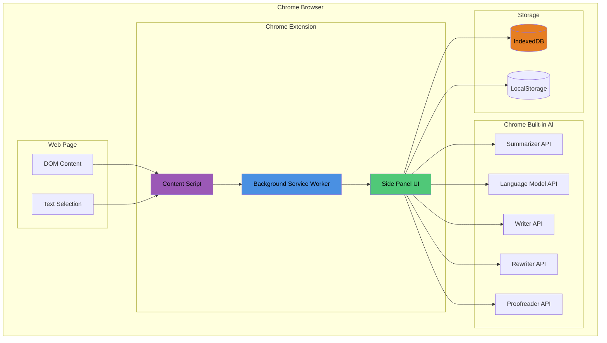
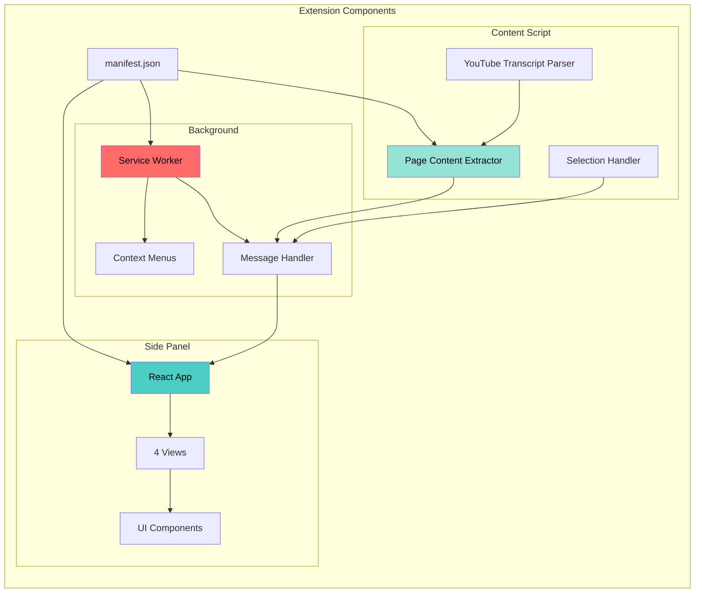
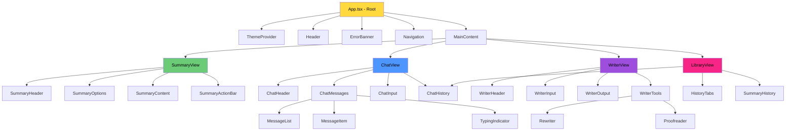
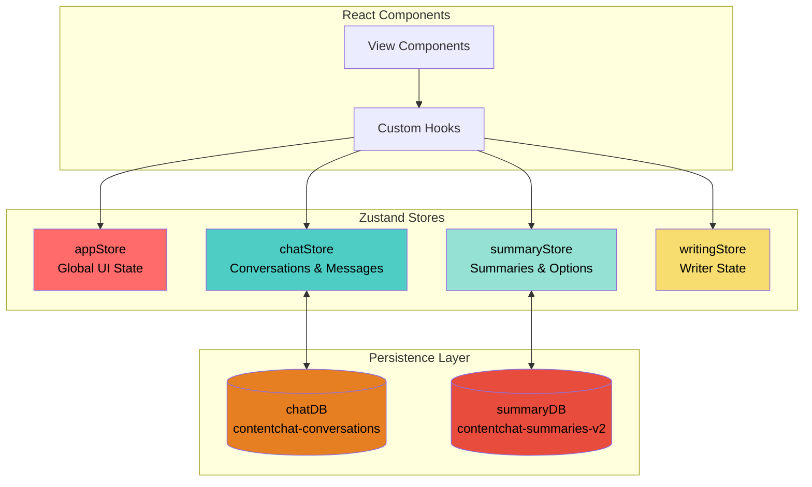
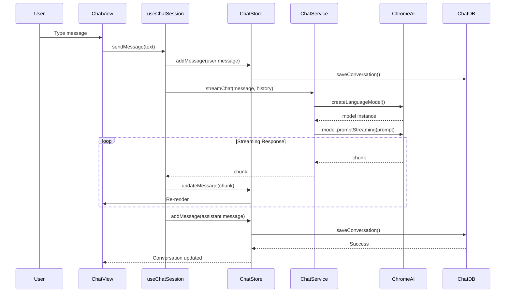
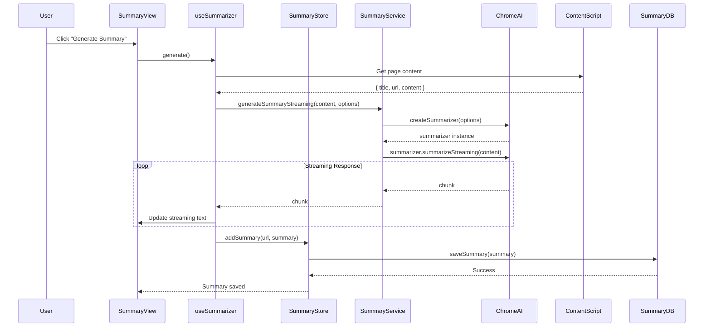
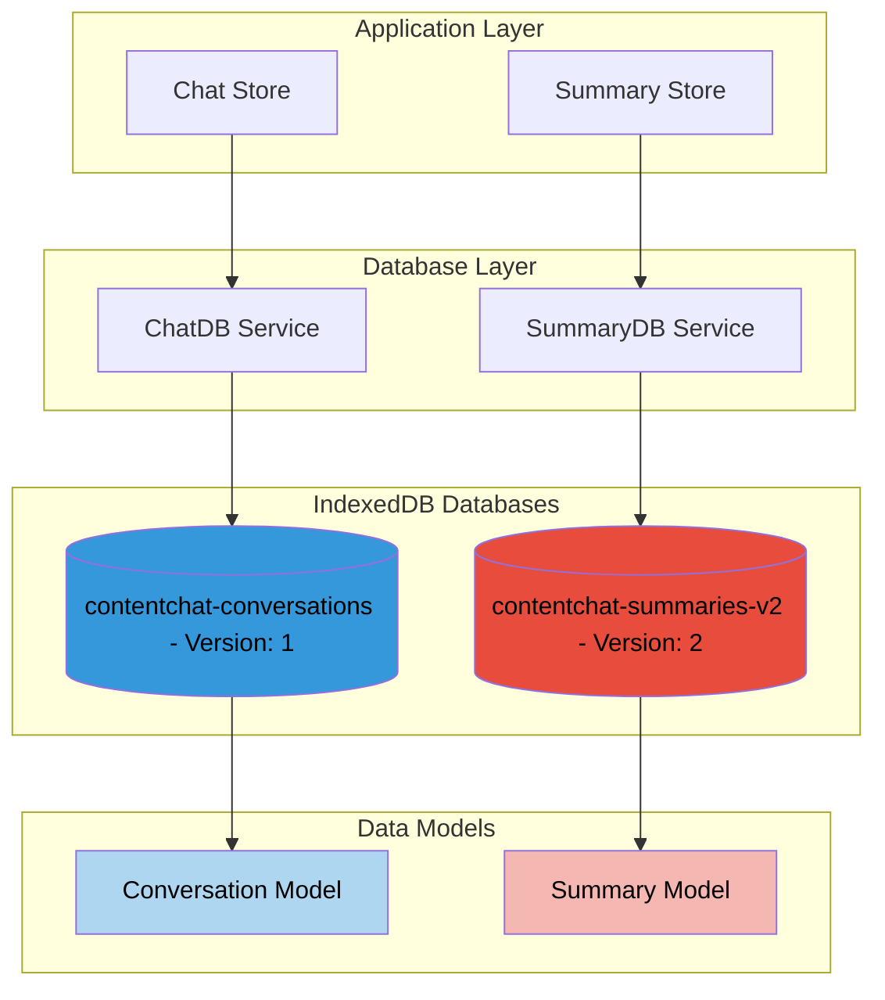
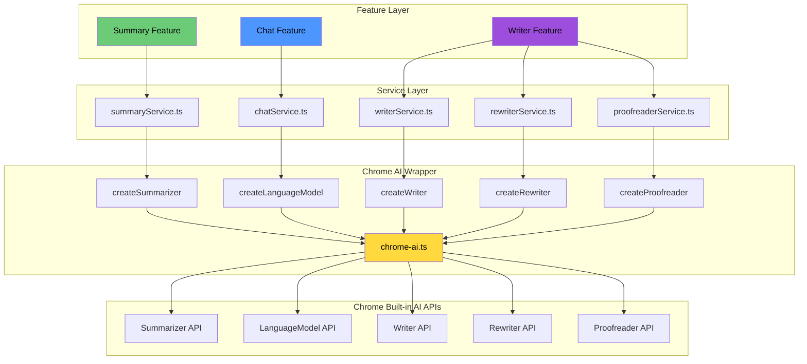
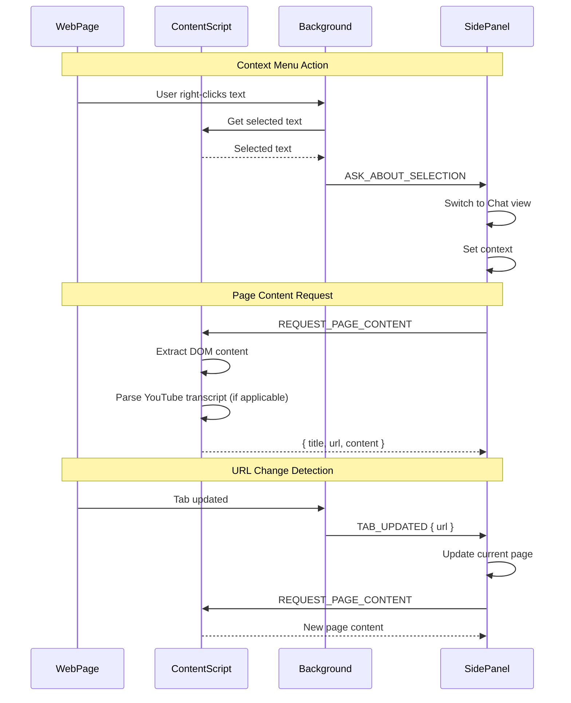

# ContentChat AI - System Architecture

> **Privacy-First AI Reading Assistant**
> Built with Chrome Built-in AI, React 19, TypeScript, and Manifest V3

**Version:** 1.0.0
**Author:** Tanzim Hossain (@0xtanzim)
**Last Updated:** November 2025

---

## Table of Contents

1. [System Overview](#system-overview)
2. [Architecture Diagrams](#architecture-diagrams)
3. [Component Details](#component-details)
4. [Data Flow](#data-flow)
5. [Design Patterns](#design-patterns)
6. [Technology Stack](#technology-stack)
7. [Security & Privacy](#security--privacy)
8. [Performance Considerations](#performance-considerations)

---

## System Overview

ContentChat AI is a Chrome extension that leverages **Chrome Built-in AI** (Gemini Nano) to provide on-device AI capabilities without sending user data to external servers. The architecture follows a **modular, layered approach** with clear separation of concerns.

### Key Features

- **🔒 Privacy-First**: All AI processing happens on-device using Chrome Built-in AI
- **💬 Intelligent Chat**: Context-aware conversations with page content or personal mode
- **📝 Smart Summarization**: Multiple summary types (key-points, TL;DR, teaser, headline)
- **✨ AI Writer**: Generate, rewrite, and proofread content
- **📚 History Management**: Persistent storage with IndexedDB (30-day retention)
- **🎨 Modern UI**: React 19 + Tailwind CSS v4 + shadcn/ui components

### Architecture Principles

1. **Modular Design**: Feature-based organization with clear boundaries
2. **Type Safety**: Strict TypeScript with no `any` types
3. **Performance**: Lazy loading, memoization, optimistic updates
4. **Scalability**: State management with Zustand, efficient data structures
5. **Privacy**: Zero external API calls, all processing on-device
6. **Maintainability**: Clean code, SOLID principles, comprehensive logging

---

## Architecture Diagrams

### 1. High-Level System Architecture



### 2. Chrome Extension Architecture (Manifest V3)



### 3. React Component Hierarchy



### 4. State Management Architecture



### 5. Data Flow - Chat Feature



### 6. Data Flow - Summary Feature



### 7. Storage Architecture



### 8. Chrome AI Integration Flow



### 9. Message Passing Architecture



---

## Component Details

### Frontend Layer

#### **1. App.tsx - Root Component**

**Responsibilities:**

- Application initialization
- Global state management
- View routing
- IndexedDB data loading
- Chrome message listener setup
- Auto-cleanup (30-day retention)

**Key Features:**

- Lazy loading for non-critical views (Summary, Library, Writer)
- ChatView always mounted to preserve state
- Theme management with next-themes
- Error boundary integration
- Context menu integration

**Code Structure:**

```typescript
function App() {
  // Global state
  const { activeView, setActiveView } = useAppStore();

  // Chrome extension integration
  const { currentPage } = useChromeExtension();

  // Selected text context for "Ask AI About This"
  const [selectedTextContext, setSelectedTextContext] = useState(null);

  useEffect(() => {
    // Load from IndexedDB
    chatStore.loadFromIndexedDB();
    summaryStore.loadFromIndexedDB();

    // Auto-cleanup
    summaryDB.cleanupOld();
    chatDB.cleanupOld();

    // Message listeners
    chrome.runtime.onMessage.addListener(handleMessage);
  }, []);
}
```

#### **2. View Components**

##### **SummaryView**

- Page content summarization
- Multiple summary types (key-points, TL;DR, teaser, headline)
- Configurable options (length, format, detail level)
- Streaming UI with typewriter effect
- History management

##### **ChatView**

- Dual mode: page-context and personal chat
- Message history with infinite scroll
- Streaming responses with typing indicators
- Conversation management
- Context menu integration

##### **WriterView**

- AI content generation
- Text rewriting with tone/length options
- Grammar and spelling proofreading
- Real-time feedback
- Copy to clipboard

##### **LibraryView**

- Unified history for summaries and conversations
- Tabbed interface
- Search and filter
- Delete functionality
- Export options

### State Management Layer

#### **1. appStore - Global UI State**

```typescript
interface AppState {
  activeView: 'summary' | 'chat' | 'writer' | 'library';
  aiAvailable: boolean;
  error: string | null;
}
```

**Purpose:** Manage global UI state and error handling

#### **2. chatStore - Conversation Management**

```typescript
interface ChatState {
  conversations: Record<string, Conversation>;
  activeConversationId: string | null;
  settings: ChatSettings;

  // Operations
  createConversation();
  addMessage();
  updateMessage();
  deleteConversation();

  // IndexedDB sync
  syncToIndexedDB();
  loadFromIndexedDB();
}
```

**Key Features:**

- Dual mode support (page-context, personal)
- Message status tracking (sending, sent, error)
- Automatic persistence to IndexedDB
- 30-day retention policy
- Type guards to prevent data mixing

#### **3. summaryStore - Summary Management**

```typescript
interface SummaryState {
  summaries: Record<string, Record<string, Summary>>;
  activeOptions: SummaryOptions;

  // Operations
  addSummary();
  getSummary();
  clearSummaries();

  // History
  getAllHistory();
  deleteHistoryItem();

  // IndexedDB sync
  syncToIndexedDB();
  loadFromIndexedDB();
}
```

**Key Features:**

- Nested storage by URL and options hash
- Deduplication based on options
- Statistics tracking (word count, compression ratio)
- Automatic cleanup
- Type guards for data isolation

#### **4. writingStore - Writer State**

```typescript
interface WritingState {
  generatedContent: string;
  isGenerating: boolean;
  error: string | null;
}
```

**Purpose:** Manage writer/rewriter/proofreader state

### Service Layer

#### **1. summaryService - Summarization Logic**

**Responsibilities:**

- Validate content before summarization
- Create summarizer instances with options
- Handle streaming responses
- Build context from detail level
- Error handling and recovery

**Key Methods:**

```typescript
async generateSummaryStreaming(
  content: string,
  options: SummaryOptions
): Promise<StreamingResult>

validateContent(content: string): ValidationResult

buildContext(options: SummaryOptions): string
```

#### **2. chatService - Chat Logic**

**Responsibilities:**

- Create language model sessions
- Build conversation context
- Stream chat responses
- Handle errors and retries
- Token management

**Key Methods:**

```typescript
async streamChat(
  message: string,
  history: Message[],
  systemPrompt?: string
): Promise<ReadableStream>

buildConversationContext(messages: Message[]): string
```

#### **3. writerService - Content Generation**

**Responsibilities:**

- Generate content from prompts
- Stream generated text
- Handle context and tone
- Error handling

#### **4. rewriterService - Text Improvement**

**Responsibilities:**

- Rewrite text with different tones
- Adjust length (shorter/longer)
- Maintain meaning
- Stream results

#### **5. proofreaderService - Grammar Checking**

**Responsibilities:**

- Check grammar and spelling
- Provide corrections
- Explain issues
- Real-time feedback

### Data Layer

#### **1. chatDB - Conversation Persistence**

**Database:** `contentchat-conversations`
**Version:** 1
**Store:** `conversations`

**Schema:**

```typescript
interface ChatDB extends DBSchema {
  conversations: {
    key: string; // conversation ID
    value: Conversation;
    indexes: {
      'by-mode': string;
      'by-url': string;
      'by-updated': number;
      'by-created': number;
    };
  };
}
```

**Key Methods:**

- `saveConversation(conversation)` - Upsert conversation
- `getConversation(id)` - Retrieve by ID
- `getAllConversations()` - Retrieve all (sorted by updatedAt)
- `getConversationsByMode(mode)` - Filter by mode
- `deleteConversation(id)` - Delete single
- `cleanupOld()` - Auto-delete >30 days

**Retention Policy:** 30 days based on `updatedAt` timestamp

#### **2. summaryDB - Summary Persistence**

**Database:** `contentchat-summaries-v2`
**Version:** 2
**Store:** `summaries`

**Schema:**

```typescript
interface SummaryDB extends DBSchema {
  summaries: {
    key: string; // auto-generated ID
    value: Summary;
    indexes: {
      'by-url': string;
      'by-timestamp': number;
      'by-page-title': string;
    };
  };
}
```

**Key Methods:**

- `saveSummary(summary)` - Store summary
- `getSummariesForUrl(url)` - Retrieve by URL
- `getAllSummaries()` - Retrieve all (sorted by timestamp)
- `deleteSummary(url, timestamp)` - Delete specific
- `cleanupOld()` - Auto-delete >30 days
- `migrateFromLocalStorage()` - One-time migration

**Retention Policy:** 30 days based on `timestamp`

### Chrome Extension Layer

#### **1. Background Service Worker**

**File:** `src/background/background.ts`

**Responsibilities:**

- Context menu creation ("Ask AI About This", "Generate Content")
- Message routing between components
- Side panel management
- Extension lifecycle management

**Key Features:**

```typescript
// Context menu setup
chrome.runtime.onInstalled.addListener(() => {
  chrome.contextMenus.create({
    id: 'ask-ai',
    title: 'Ask AI About This',
    contexts: ['selection'],
  });
});

// Message handling
chrome.runtime.onMessage.addListener((message, sender, sendResponse) => {
  if (message.type === 'ASK_ABOUT_SELECTION') {
    // Forward to side panel
  }
});
```

#### **2. Content Script**

**File:** `src/content/content.ts`

**Responsibilities:**

- Extract page content (DOM parsing)
- YouTube transcript extraction
- Handle text selection
- Respond to content requests

**Key Features:**

```typescript
// Page content extraction
function extractPageContent(): PageContent {
  return {
    title: document.title,
    url: window.location.href,
    content: extractTextContent(document.body),
    metadata: extractMetadata(),
  };
}

// YouTube transcript parsing
async function getYouTubeTranscript(videoId: string): Promise<string>;
```

**Content Extraction Strategy:**

1. Check for `<article>` elements
2. Check for `<main>` elements
3. Fall back to `<body>` with noise removal
4. Remove scripts, styles, navigation, ads

#### **3. Side Panel UI**

**File:** `src/sidepanel/index.html`

**Responsibilities:**

- Render React application
- Provide UI for all features
- Handle user interactions
- Display AI responses

**Integration:**

```json
{
  "side_panel": {
    "default_path": "src/sidepanel/index.html"
  }
}
```

### Chrome AI Layer

#### **chrome-ai.ts - AI API Wrapper**

**Purpose:** Abstract Chrome Built-in AI APIs with error handling and logging

**Key Functions:**

##### **Feature Detection**

```typescript
function isAIAvailable(): boolean;
async function checkCapability(api): Promise<Status>;
```

##### **Summarizer API**

```typescript
async function createSummarizer(
  options?: SummarizerOptions
): Promise<Summarizer>;

// Options:
interface SummarizerOptions {
  type: 'key-points' | 'tl;dr' | 'teaser' | 'headline';
  length: 'short' | 'medium' | 'long';
  format: 'markdown' | 'plain-text';
}
```

##### **Language Model API (Chat)**

```typescript
async function createLanguageModel(
  options?: LanguageModelOptions
): Promise<LanguageModel>;

// Options:
interface LanguageModelOptions {
  temperature?: number; // 0-1
  topK?: number; // Number of tokens to consider
  systemPrompt?: string;
}
```

##### **Writer API**

```typescript
async function createWriter(options?: WriterOptions): Promise<Writer>;

// Options:
interface WriterOptions {
  sharedContext?: string; // Additional context
  tone?: 'formal' | 'neutral' | 'casual';
  format?: 'plain-text' | 'markdown';
  length?: 'short' | 'medium' | 'long';
}
```

##### **Rewriter API**

```typescript
async function createRewriter(options?: RewriterOptions): Promise<Rewriter>;

// Options:
interface RewriterOptions {
  tone?: 'as-is' | 'more-formal' | 'more-casual';
  length?: 'as-is' | 'shorter' | 'longer';
  format?: 'as-is' | 'plain-text' | 'markdown';
  sharedContext?: string;
}
```

##### **Proofreader API**

```typescript
async function createProofreader(
  options?: ProofreaderOptions
): Promise<Proofreader>;

// Options:
interface ProofreaderOptions {
  type?: 'grammar' | 'spelling' | 'both';
  sharedContext?: string;
}
```

**Error Handling Pattern:**

```typescript
try {
  if (!self.Summarizer) {
    throw new Error('Summarizer API not available');
  }

  const summarizer = await self.Summarizer.create(options);
  return summarizer;
} catch (error) {
  logger.error('Failed to create summarizer:', error);
  throw error;
}
```

---

## Data Flow

### 1. Summary Generation Flow

```
User Action
  ↓
SummaryView: Click "Generate"
  ↓
useSummarizer Hook
  ↓
Get page content from content script
  ↓
summaryService.generateSummaryStreaming()
  ↓
chrome-ai.createSummarizer(options)
  ↓
Chrome Built-in AI: Summarizer API
  ↓
Stream chunks back to UI
  ↓
summaryStore.addSummary()
  ↓
summaryDB.saveSummary() → IndexedDB
  ↓
UI Update: Display summary
```

### 2. Chat Message Flow

```
User Action
  ↓
ChatView: Type message
  ↓
useChatSession Hook
  ↓
chatStore.addMessage(user message)
  ↓
chatDB.saveConversation() → IndexedDB
  ↓
chatService.streamChat(message, history)
  ↓
chrome-ai.createLanguageModel()
  ↓
Chrome Built-in AI: LanguageModel API
  ↓
Stream response chunks
  ↓
Update UI with streaming text
  ↓
chatStore.addMessage(assistant message)
  ↓
chatDB.saveConversation() → IndexedDB
```

### 3. Context Menu Flow

```
User Action: Right-click selected text
  ↓
Background: Context menu item clicked
  ↓
Content Script: Get selected text
  ↓
Background: Forward to side panel
  ↓
Side Panel: Receive ASK_ABOUT_SELECTION message
  ↓
App: Switch to Chat view
  ↓
ChatView: Set selected text as context
  ↓
User can now chat about the selection
```

### 4. Page Content Extraction Flow

```
Side Panel: Request page content
  ↓
chrome.tabs.sendMessage(REQUEST_PAGE_CONTENT)
  ↓
Content Script: Extract page content
  ↓
  - Parse DOM structure
  - Extract text from <article>, <main>, or <body>
  - Remove noise (scripts, styles, ads)
  - Check if YouTube video
  - Extract transcript if YouTube
  ↓
Content Script: Send response
  ↓
Side Panel: Receive { title, url, content }
  ↓
Store in useChromeExtension hook
  ↓
Available for summarization or chat context
```

---

## Design Patterns

### 1. **Factory Pattern**

**Used in:** Conversation creation, AI model instantiation

```typescript
// useConversationManager.ts
const conversationFactory = useCallback(() => {
  // Check existing conversation
  // Find by mode and URL
  // Create new if not found
  return getOrCreateConversation(mode, url, pageTitle);
}, [mode, url, pageTitle]);
```

### 2. **Repository Pattern**

**Used in:** Data persistence layer

```typescript
// chatDB.ts, summaryDB.ts
class ChatDatabase {
  async saveConversation(conversation: Conversation): Promise<void>;
  async getConversation(id: string): Promise<Conversation>;
  async getAllConversations(): Promise<Conversation[]>;
  async deleteConversation(id: string): Promise<void>;
}
```

### 3. **Observer Pattern**

**Used in:** State management with Zustand

```typescript
// Components subscribe to store changes
const conversations = useChatStore((state) => state.conversations);

// Store notifies subscribers on change
set({ conversations: { ...state.conversations, [id]: updated } });
```

### 4. **Strategy Pattern**

**Used in:** Summary type selection, rewriter options

```typescript
// Different summarization strategies
type SummaryType = 'key-points' | 'tldr' | 'teaser' | 'headline';

// Different rewriter tones
type RewriterTone = 'more-formal' | 'more-casual' | 'as-is';
```

### 5. **Adapter Pattern**

**Used in:** Chrome AI API wrapper

```typescript
// chrome-ai.ts adapts Chrome Built-in AI to our interface
export async function createSummarizer(
  options?: SummarizerOptions
): Promise<Summarizer> {
  // Adapt our options to Chrome API format
  const chromeOptions = adaptOptions(options);
  return await self.Summarizer.create(chromeOptions);
}
```

### 6. **Singleton Pattern**

**Used in:** Database instances, logger

```typescript
// chatDB.ts
export const chatDB = new ChatDatabase(); // Single instance

// logger.ts
export function createLogger(namespace: string) {
  return new Logger(namespace); // Namespaced singleton
}
```

### 7. **Lazy Initialization Pattern**

**Used in:** React lazy loading, database initialization

```typescript
// App.tsx
const SummaryView = lazy(() => import('./components/summary'));

// chatDB.ts
private async init() {
  if (this.db) return; // Already initialized
  this.db = await openDB(...);
}
```

### 8. **Type Guard Pattern**

**Used in:** Data validation, prevent mixing

```typescript
// chatStore.ts
conversations.forEach((conv) => {
  if (
    'messages' in conv &&
    Array.isArray(conv.messages) &&
    !('content' in conv) // Not a Summary
  ) {
    conversationsRecord[conv.id] = conv;
  }
});
```

---

## Technology Stack

### Frontend

| Technology   | Version | Purpose       |
| ------------ | ------- | ------------- |
| React        | 19.2.0  | UI framework  |
| TypeScript   | 5.9.3   | Type safety   |
| Vite         | 5.4.11  | Build tool    |
| Tailwind CSS | 4.0.0   | Styling       |
| shadcn/ui    | Latest  | UI components |
| Lucide React | Latest  | Icons         |

### State Management

| Technology  | Version  | Purpose      |
| ----------- | -------- | ------------ |
| Zustand     | 5.0.8    | Global state |
| React Hooks | Built-in | Local state  |

### Data Persistence

| Technology   | Purpose                   |
| ------------ | ------------------------- |
| IndexedDB    | Primary storage           |
| idb          | IndexedDB wrapper         |
| LocalStorage | Legacy (being phased out) |

### Chrome APIs

| API                 | Purpose              |
| ------------------- | -------------------- |
| chrome.runtime      | Messaging, lifecycle |
| chrome.tabs         | Tab management       |
| chrome.sidePanel    | Side panel UI        |
| chrome.contextMenus | Context menu items   |
| chrome.storage      | Extension settings   |

### Chrome Built-in AI APIs

| API                  | Purpose            | Status     |
| -------------------- | ------------------ | ---------- |
| Summarizer API       | Text summarization | ✅ Stable  |
| LanguageModel API    | Chat/completion    | ✅ Stable  |
| Writer API           | Content generation | ✅ Stable  |
| Rewriter API         | Text improvement   | ✅ Stable  |
| Proofreader API      | Grammar checking   | ✅ Stable  |
| Translator API       | Translation        | 🔜 Planned |
| LanguageDetector API | Language detection | 🔜 Planned |

### Development Tools

| Tool       | Purpose         |
| ---------- | --------------- |
| ESLint     | Code linting    |
| Prettier   | Code formatting |
| Vitest     | Unit testing    |
| Playwright | E2E testing     |

---

## Security & Privacy

### Privacy-First Architecture

1. **No External API Calls**

   - All AI processing happens on-device
   - No data sent to external servers
   - Zero telemetry or tracking

2. **Data Isolation**

   - Type guards prevent data mixing
   - Separate IndexedDB databases
   - Clear data boundaries

3. **Content Security Policy**

   - No inline scripts
   - No eval() or Function()
   - All resources loaded from extension

4. **Permission Minimization**
   - Only required permissions
   - `activeTab` instead of `tabs`
   - `<all_urls>` only for content script

### Security Measures

1. **Input Sanitization**

   - DOMPurify for user content
   - Type validation at boundaries
   - No dangerouslySetInnerHTML without sanitization

2. **XSS Prevention**

   - Strict CSP
   - No dynamic code execution
   - Sanitize all user inputs

3. **Data Retention**

   - Automatic 30-day cleanup
   - User can manually delete
   - No permanent storage without consent

4. **Error Handling**
   - Never expose sensitive data in errors
   - Graceful degradation
   - User-friendly error messages

---

## Performance Considerations

### Optimization Strategies

1. **Code Splitting**

   - Lazy load non-critical views
   - Dynamic imports for heavy components
   - Bundle size: <150KB target

2. **React Optimization**

   - `React.memo()` for expensive components
   - `useMemo()` for heavy computations
   - `useCallback()` for stable function references
   - Shallow comparison for Zustand selectors

3. **State Management**

   - Avoid unnecessary re-renders
   - Use `useShallow()` from Zustand
   - Selective subscriptions
   - Memoized selectors

4. **IndexedDB Performance**

   - Indexed queries for fast lookups
   - Batch operations where possible
   - Async operations don't block UI
   - Cleanup runs in background

5. **AI Performance**
   - Streaming responses for better UX
   - Cancel in-flight requests
   - Reuse AI model instances
   - Efficient token management

### Performance Metrics

| Metric               | Target | Current |
| -------------------- | ------ | ------- |
| Side panel open time | <2s    | ~1.5s   |
| Summary generation   | <5s    | ~3-4s   |
| Chat response start  | <1s    | ~0.8s   |
| IndexedDB query      | <100ms | ~50ms   |
| Bundle size          | <150KB | ~120KB  |
| Memory usage         | <50MB  | ~40MB   |

---

## Future Enhancements

### Planned Features

1. **Enhanced AI Capabilities**

   - Translator API integration
   - Language detection
   - Multi-modal input support

2. **Improved UX**

   - Voice input for chat
   - Export conversations as PDF/Markdown
   - Themes customization
   - Keyboard shortcuts

3. **Data Management**

   - Cloud sync (optional)
   - Import/export settings
   - Advanced search in history
   - Tags and categories

4. **Performance**

   - Service worker caching
   - Preload frequently used models
   - Background summarization
   - Predictive content loading

5. **Developer Features**
   - API for third-party integrations
   - Plugin system
   - Custom prompts
   - Advanced settings

---

## Conclusion

ContentChat AI demonstrates a well-architected Chrome extension leveraging cutting-edge Chrome Built-in AI APIs. The modular design, clear separation of concerns, and privacy-first approach make it a robust and maintainable solution.

**Key Strengths:**

- ✅ Privacy-first with on-device AI
- ✅ Clean, modular architecture
- ✅ Type-safe with TypeScript
- ✅ Efficient state management
- ✅ Persistent storage with IndexedDB
- ✅ Performance-optimized
- ✅ Scalable and maintainable

**For Contributors:**

- Follow the established patterns
- Maintain type safety
- Add comprehensive logging
- Write tests for new features
- Update documentation

**For Users:**

- All data stays on your device
- No external API keys required
- Works offline
- Fast and responsive

---

**Built with ❤️ by Tanzim Hossain (@0xtanzim)**

**License:** MIT

**Repository:** [github.com/0xtanzim/contentchat-ai](https://github.com/0xtanzim/contentchat-ai)
